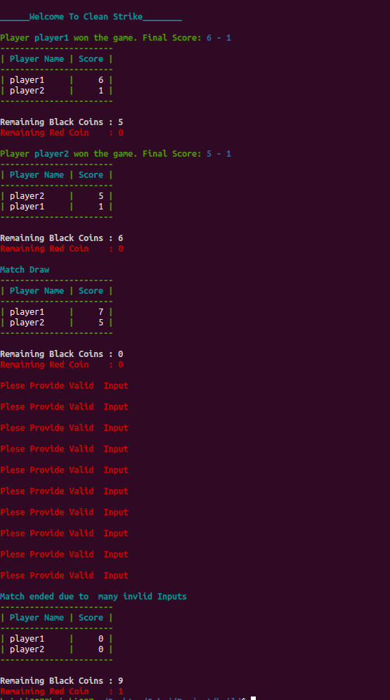
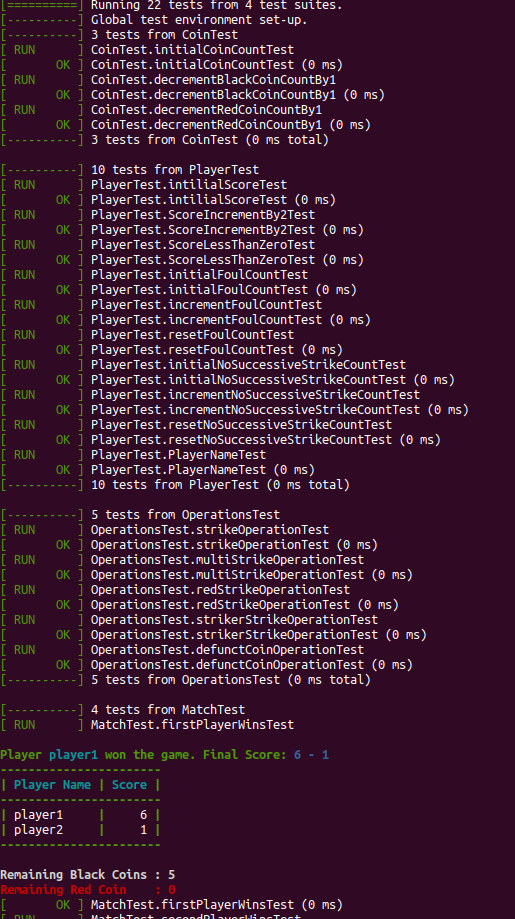

# CleanStrike
It is carrom board game played by 2 players with multiple turns 

## How To Run 
### 1. Using Cmake 
* Create a directory named build source folder
    >**mkdir build**

* Go to build directory
    >**cd build**

* Run CMake command
    >**cmake ..**

* Build the project
    >**make**
### 2. To run the Main program execute following in build folder
>**./CleanStrikeByHrishi**

### 3. To run test 

* Go to build/test directory
    >**cd build/test**

* Run CMake command
    >**./CleanStrikeByHrishiTests**

